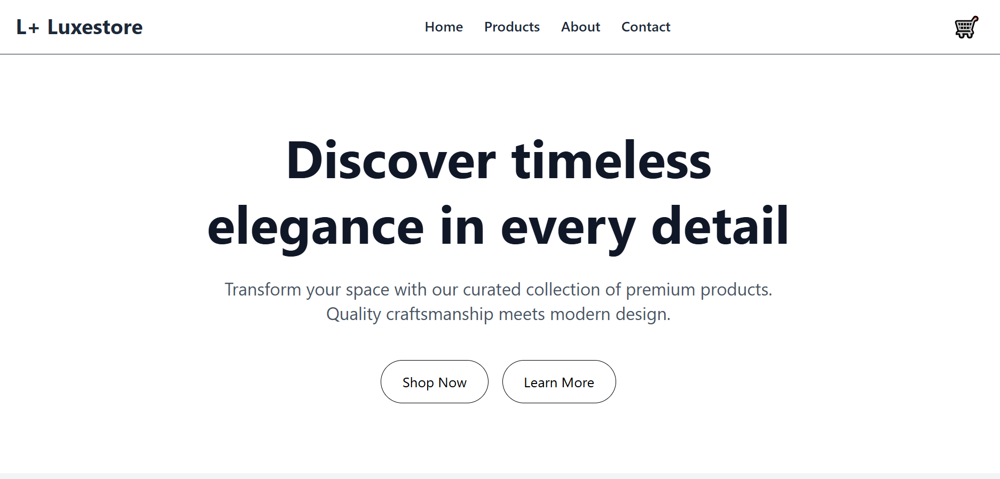

# LuxeStore - Static E-commerce Homepage

A modern, responsive e-commerce website built with React, Vite, and Tailwind CSS. This project demonstrates component-based architecture, routing, props usage, and event handling.

## 🌟 Features

- **Four Main Pages**: Home, Products, About, and Contact
- **Responsive Design**: Fully responsive across desktop, tablet, and mobile devices
- **Reusable Components**: Modular component architecture with Navbar, Footer, ProductCard, and HeroSection
- **Dynamic Product Display**: 12 products across 3 categories (Electronics, Fashion, Accessories)
- **Interactive Elements**: Add to Cart functionality with event handling
- **Category Filtering**: Filter products by category on the Products page
- **Contact Form**: Functional contact form with form validation

## 📸 Screenshots

## 🛠️ Technologies Used

- **React** - UI library for building component-based interfaces
- **Vite** - Fast build tool and development server
- **React Router DOM** - Client-side routing
- **Tailwind CSS** - Utility-first CSS framework
- **JavaScript (ES6+)** - Modern JavaScript features

## 📋 Pages

1. **Home** - Home section with welcome message, 8 featured products, and "Why Choose Us" section
2. **Products** - Complete product catalog with category filtering (12 products total)
3. **About** - Company story, mission statement, and "Why Choose Us" benefits
4. **Contact** - Contact information and feedback form

### Installation

1. **Clone the repository**
   --- bash
   git clone https://github.com/Ualine055/e-commerce-project.git

   cd luxestore-ecommerce

   ---

2. **Open your browser**
   
   Navigate to `http://localhost:5174/` to view the application.

## 📁 Project Structure

---

luxestore-ecommerce/
├── public/
│   └── vite.svg
├── src/
│   ├── components/
│   │   ├── Navbar.jsx          # Navigation bar component
│   │   ├── Footer.jsx 
|   |   ├── Home.jsx            # Homepage
│   │   ├── Products.jsx        # Products listing page
│   │   ├── About.jsx           # About page
│   │   └── Contact.jsx          # Footer component
│   ├── App.jsx                 # Main app component with routing
│   ├── main.jsx                # Application entry point
│   └── index.css               # Global styles and Tailwind imports
├── index.html                  # HTML template
├── package.json                # Dependencies and scripts
├── vite.config.js              # Vite configuration
├── tailwind.config.js          # Tailwind CSS configuration
├── postcss.config.js           # PostCSS configuration
└── README.md                   # Project documentation
---

## 🔗 Live Demo

[View Live Demo](https://your-deployment-url.vercel.app)
